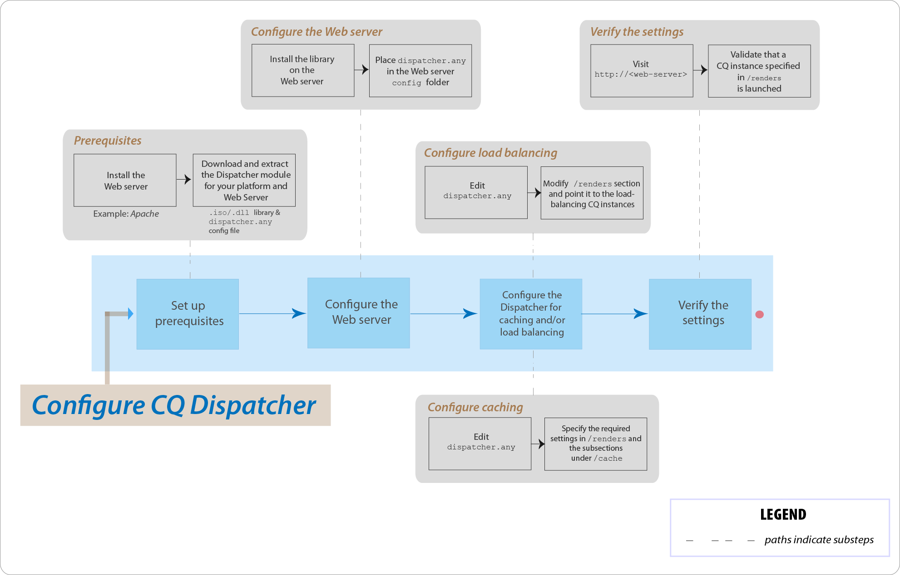

# Vanliga frågor om AEM Dispatcher



## Introduktion

### Vad är Dispatcher?

Dispatcher också Adobe Experience Manager cachning, eller belastningsutjämningsverktyg, eller båda, som kan förverkliga en snabb och dynamisk webbutvecklingsmiljö. För cachning fungerar Dispatcher som en del av en HTTP-server, till exempel Apache. Syftet är att lagra (eller&quot;cachelagra&quot;) så mycket som möjligt av det statiska webbplatsinnehållet. Och så sällan som möjligt får du tillgång till webbplatsens motor. I en lastbalanserande roll distribuerar Dispatcher användarförfrågningar (inläsning) över olika AEM instanser (renderingar).

För cachelagring använder Dispatcher-modulen webbserverns förmåga att hantera statiskt innehåll. Dispatcher placerar de cachelagrade dokumenten i dokumentroten på webbservern.

### Hur utför Dispatcher cachelagring?

Dispatcher använder webbserverns funktioner för statiskt innehåll. Dispatcher lagrar cachelagrade dokument i dokumentroten på webbservern. Dispatcher har två primära metoder för att uppdatera cacheinnehållet när ändringar görs på webbplatsen.

* **Innehållsuppdateringar** tar bort sidor som har ändrats och filer som är direkt kopplade till dem.
* **Automatisk invalidering** gör automatiskt de delar av cachen som kan vara inaktuella efter en uppdatering blir ogiltiga. Det flaggar till exempel att relevanta sidor är inaktuella, utan att något tas bort.

### Vilka är fördelarna med lastbalansering?

Belastningsutjämning distribuerar användarförfrågningar (inläsning) över flera AEM instanser. I följande lista beskrivs fördelarna med belastningsutjämning:

* **Ökad bearbetningskraft**: I praktiken innebär den här metoden att Dispatcher delar dokumentbegäranden mellan flera instanser av AEM. Eftersom varje instans har färre dokument att behandla har du snabbare svarstider. Dispatcher sparar intern statistik för varje dokumentkategori så att den kan beräkna belastningen och distribuera frågorna effektivt.
* **Ökad felsäker täckning**: Om Dispatcher inte tar emot svar från en instans vidarebefordrar den automatiskt begäranden till en av de andra instanserna. Om en instans blir otillgänglig är den enda effekten en nedgång av webbplatsen, som står i proportion till den förlorade datorkraften.

>[!NOTE]
>
>Mer information finns på sidan [Dispatcher - översikt](dispatcher.md)

## Installera och konfigurera

### Var hämtar jag Dispatcher-modulen från?

Du kan hämta den senaste Dispatcher-modulen från sidan [Versionsinformation för Dispatcher](release-notes.md).

### Hur installerar jag Dispatcher-modulen?

Se sidan [Installera Dispatcher](dispatcher-install.md)

### Hur konfigurerar jag Dispatcher-modulen?

Se sidan [Konfigurera Dispatcher](dispatcher-configuration.md).

### Hur konfigurerar jag Dispatcher för författarinstansen?

Mer information finns i [Använda Dispatcher med en författarinstans](dispatcher.md#using-a-dispatcher-with-an-author-server).

### Hur konfigurerar jag Dispatcher med flera domäner?

Du kan konfigurera CQ Dispatcher med flera domäner, förutsatt att domänerna uppfyller följande villkor:

* Webbinnehållet för båda domänerna lagras i en enda AEM
* Filerna i Dispatcher-cachen kan göras ogiltiga separat för varje domän

Läs [Använda Dispatcher med flera domäner](dispatcher-domains.md) om du vill ha mer information.

### Hur konfigurerar jag Dispatcher så att alla begäranden från en användare dirigeras till samma Publish-instans?

Du kan använda funktionen [klisterlappande anslutningar](dispatcher-configuration.md#identifying-a-sticky-connection-folder-stickyconnectionsfor) som ser till att alla dokument för en användare bearbetas i samma instans av AEM. Den här funktionen är viktig om du använder personaliserade sidor och sessionsdata. Data lagras på instansen. Därför måste efterföljande begäranden från samma användare returnera till den instansen, annars går data förlorade.

Eftersom häftiga anslutningar begränsar Dispatcher förmåga att optimera förfrågningar bör du bara använda den här metoden när det behövs. Du kan ange den mapp som innehåller de&quot;klisterlappande&quot; dokumenten, så att alla dokument i mappen behandlas i samma instans för en användare.

### Kan jag använda kladdiga anslutningar och cachelagring tillsammans?

För de flesta sidor där klisterlappande anslutningar används bör du inaktivera cachelagring. I annat fall visas samma instans av sidan för alla användare, oavsett sessionsinnehållet.

I vissa program kan du använda både fast anslutning och cachelagring. Om du till exempel visar ett formulär som skriver data till en session, kan du använda kladdiga anslutningar och cachelagring tillsammans.

### Kan en Dispatcher och en AEM Publish-instans finnas på samma fysiska dator?

Ja, om maskinen är tillräckligt kraftfull. Du bör dock konfigurera Dispatcher- och AEM Publish-instansen på olika datorer.

Vanligtvis finns Publishing-instansen inuti brandväggen och Dispatcher finns i DMZ. Om du väljer att ha både Publishing-instansen och Dispatcher på samma fysiska dator måste du se till att brandväggsinställningarna förhindrar direktåtkomst till Publishing-instansen från externa nätverk.

### Kan jag bara cachelagra filer med specifika tillägg?

Ja. Om du till exempel bara vill cachelagra GIF-filer anger du *.gif i cache-avsnittet i dispatcher.any-konfigurationsfilen.

### Hur tar jag bort filer från cachen?

Du kan ta bort filer från cachen genom att använda en HTTP-begäran. När HTTP-begäran tas emot tar Dispatcher bort filerna från cachen. Dispatcher cachelagrar filerna igen endast när det tar emot en klientbegäran för sidan. Att ta bort cachelagrade filer på det här sättet är lämpligt för webbplatser som sannolikt inte tar emot samtidiga begäranden för samma sida.

HTTP-begäran har följande syntax:

```
POST /dispatcher/invalidate.cache HTTP/1.1
CQ-Action: Activate
CQ-Handle: path-pattern
Content-Length: 0
```

Dispatcher tar bort cachelagrade filer och mappar med namn som matchar värdet i CQ-Handle-huvudet. En CQ-Handle på `/content/geomtrixx-outdoors/en` matchar till exempel följande objekt:

Alla filer (oavsett filtillägg) med namnet en i katalogen geometrixx-outdoor.
En katalog med namnet `_jcr_content` under katalogen en (som, om den finns, innehåller cachelagrade återgivningar av sidans undernoder).
Katalogen `en` tas bara bort om `CQ-Action` är `Delete` eller `Deactivate`.

Mer information om det här avsnittet finns i [Invalidera Dispatcher-cachen manuellt](page-invalidate.md).

### Hur implementerar jag behörighetskänslig cachelagring?

Se sidan [Cachelagra säkert innehåll](permissions-cache.md).

### Hur skyddar jag kommunikationen mellan Dispatcher och CQ-instanserna?

Se [Dispatcher Security Checklist](security-checklist.md) och [AEM Security Checklist](https://experienceleague.adobe.com/en/docs/experience-manager-64/administering/security/security-checklist) .

### Dispatcher-utgåva `jcr:content` har ändrats till `jcr%3acontent`

**Fråga**: Företaget har nyligen stött på ett problem på Dispatcher-nivå. Ett av AJAX anrop som fick data från CQ-databasen innehöll `jcr:content`. Det kodades till `jcr%3acontent` vilket resulterade i fel resultatmängd.

**Svar**: Använd metoden `ResourceResolver.map()` om du vill hämta en egen URL som ska användas/utfärdas, hämta begäranden från och även om du vill lösa cachelagringsproblemet med Dispatcher. Metoden map() kodar kolon `:` till understreck och metoden resolve() avkodar dem tillbaka till SLING JCR-läsbart format. Använd metoden map() för att generera den URL som används i Ajax-anropet.

Läs mer: [https://sling.apache.org/documentation/the-sling-engine/mappings-for-resource-resolution.html#namespace-mangling](https://sling.apache.org/documentation/the-sling-engine/mappings-for-resource-resolution.html#namespace-mangling)

## Tvätta Dispatcher

### Hur konfigurerar jag Dispatcher push-agenter på en Publish-instans?

Se sidan [Replikering](https://experienceleague.adobe.com/en/docs/experience-manager-65/content/implementing/deploying/configuring/replication#configuring-your-replication-agents).

### Hur felsöker jag Dispatcher problem med tömning?

[Se de här felsökningsartiklarna](https://experienceleague.adobe.com/search.html?lang=en#q=troubleshooting%20dispatcher%20flushing%20issues&amp;sort=relevancy&amp;f:el_product=[Experience%20Manager]).

Om raderingsåtgärderna gör att Dispatcher rensas [använder du lösningen i det här community-blogginlägget av Sensei Martin](https://mkalugin-cq.blogspot.com/2012/04/i-have-been-working-on-following.html).

### Hur tömmer jag DAM-resurser från Dispatcher cache?

Du kan använda funktionen &quot;kedjereplikering&quot;. När den här funktionen är aktiverad skickar Dispatcher rensningsagent en tömningsbegäran när en replikering tas emot från författarinstansen.

Så här aktiverar du den:

1. [Följ stegen här](page-invalidate.md#invalidating-dispatcher-cache-from-a-publishing-instance) för att skapa tömningsagenter vid publicering
1. Gå till varje agentes konfiguration.
1. Markera kryssrutan **Vid mottagning** på fliken **Utlösare**.

## Diverse

Hur avgör Dispatcher om ett dokument är aktuellt?
Dispatcher utför följande åtgärder för att avgöra om ett dokument är uppdaterat:

Den kontrollerar om dokumentet kan ogiltigförklaras automatiskt. Annars betraktas dokumentet som uppdaterat.
Om dokumentet har konfigurerats för automatisk ogiltigförklaring kontrollerar Dispatcher om det är äldre eller nyare än den senaste tillgängliga ändringen. Om den är äldre begär Dispatcher den aktuella versionen från AEM och ersätter versionen i cachen.

### Hur returnerar Dispatcher dokument?

Du kan definiera om Dispatcher ska cachelagra ett dokument med hjälp av [Dispatcher-konfigurationsfilen ](dispatcher-configuration.md), `dispatcher.any`. Dispatcher kontrollerar begäran mot listan med cachelagrade dokument. Om dokumentet inte finns med i den här listan begär Dispatcher dokumentet från AEM.

Egenskapen `/rules` styr vilka dokument som cachelagras enligt dokumentsökvägen. Oavsett egenskapen `/rules` cachelagrar Dispatcher aldrig ett dokument under följande omständigheter:

* URI för begäran innehåller ett `(?)`-frågetecken.
* Det indikerar en dynamisk sida, till exempel ett sökresultat som inte behöver cachas.
* Filtillägget saknas.
* Webbservern behöver tillägget för att kunna avgöra dokumenttypen (MIME-typen).
* Autentiseringshuvudet är inställt (konfigurerbart).
* Om AEM svarar med följande rubriker:
   * no-cache
   * no store
   * must-revalidate

Dispatcher lagrar cachelagrade filer på webbservern som om de var en del av en statisk webbplats. Om en användare begär ett cachelagrat dokument kontrollerar Dispatcher om dokumentet finns i webbserverns filsystem. I så fall returnerar Dispatcher dokumenten. Annars begär Dispatcher dokumentet från AEM.

>[!NOTE]
>
>Metoderna GET och HEAD (för HTTP-huvudet) kan nås av Dispatcher. Mer information om cachelagring av svarshuvuden finns i avsnittet [Caching HTTP Response Headers](dispatcher-configuration.md#caching-http-response-headers).

### Kan jag implementera flera utskickare i en konfiguration?

Ja. I så fall måste du se till att båda utskickarna har direktåtkomst till den AEM webbplatsen. En Dispatcher kan inte hantera förfrågningar från en annan Dispatcher.
