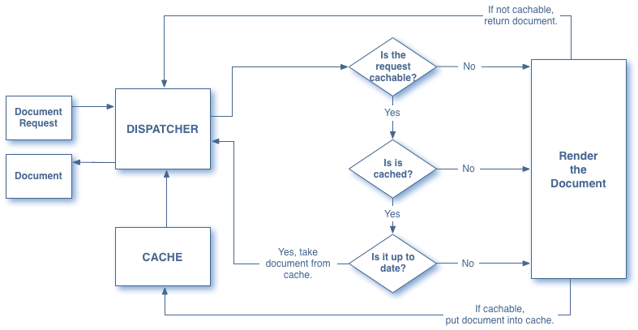

# Dispatcher - översikt {#dispatcher-overview}

>[!NOTE]
>
>Dispatcher-versionerna är oberoende av AEM (Adobe Experience Manager). Du kan ha omdirigerats till den här sidan om du har följt en länk till Dispatcher-dokumentationen. Länken var inbäddad i dokumentationen för en tidigare version av AEM.

Dispatcher är Adobe Experience Manager verktyg för cachning och belastningsutjämning som används med en webbserver i företagsklass.

Processen för att distribuera Dispatcher är oberoende av webbservern och den OS-plattform som valts:

1. Läs mer om Dispatcher (här). Se även [vanliga frågor om Dispatcher](/help/using/dispatcher-faq.md).
1. Installera en [stödd webbserver](https://experienceleague.adobe.com/en/docs/experience-manager-65/content/implementing/deploying/introduction/technical-requirements) enligt webbserverns dokumentation.
1. [Installera Dispatcher-modulen](dispatcher-install.md) på webbservern och konfigurera webbservern i enlighet med detta.
1. [Konfigurera Dispatcher](dispatcher-configuration.md) (filen dispatcher.any).
1. [Konfigurera AEM](page-invalidate.md) så att innehållsuppdateringar gör cachen ogiltig.

>[!NOTE]
>
>Så här får du en bättre förståelse för hur Dispatcher fungerar med AEM:
>
>* Se [Fråga AEM community-experter i juli 2017](https://communities.adobeconnect.com/pf0gem7igw1f/).
>* Åtkomst till [den här databasen](https://github.com/adobe/aem-dispatcher-experiments). Den innehåller en samling experiment i ett&quot;start-home&quot;-laboratorieformat.


Använd följande information efter behov:

* [Dispatcher Security Checklist](security-checklist.md)
* [Dispatcher Knowledge Base](https://helpx.adobe.com/experience-manager/kb/index/dispatcher.html)
* [Optimera en webbplats för cacheprestanda](https://experienceleague.adobe.com/en/docs/experience-manager-65/content/implementing/deploying/configuring/configuring-performance)
* [Använda Dispatcher med flera domäner](dispatcher-domains.md)
* [Använda SSL med Dispatcher](dispatcher-ssl.md)
* [Implementera behörighetskänslig cachelagring](permissions-cache.md)
* [Felsökning av Dispatcher-problem](dispatcher-troubleshooting.md)
* [Vanliga frågor om Dispatcher](dispatcher-faq.md)

>[!NOTE]
>
>**Det vanligaste användningsområdet för Dispatcher** är att cachelagra svar från en AEM **publiceringsinstans** för att öka svarstiden och säkerheten för den externt riktade publicerade webbplatsen. Det mesta av diskussionen fokuserar på detta fall.
>
>Men Dispatcher kan också användas för att öka svarstiden för din **författarinstans**. Detta gäller särskilt om du har ett stort antal användare som redigerar och uppdaterar din webbplats. Mer information om det här fallet finns i [Använda en Dispatcher med en författarserver](#using-a-dispatcher-with-an-author-server) nedan.

## Varför använda Dispatcher för att implementera Caching? {#why-use-dispatcher-to-implement-caching}

Det finns två grundläggande strategier för webbpublicering:

* **Statiska webbservrar**: t.ex. Apache eller IIS är enkla, men snabba.
* **Content Management-servrar**: som tillhandahåller dynamiskt, intelligent innehåll i realtid, men som kräver mer beräkningstid och andra resurser.

Dispatcher kan förverkliga en miljö som är både snabb och dynamisk. Den fungerar som en del av en statisk HTML-server, som Apache, med syftet att:

* lagra (eller&quot;cachelagra&quot;) så mycket som möjligt av webbplatsinnehållet som en statisk webbplats
* så lite som möjligt med åtkomst till layoutmotorn.

Detta innebär att

* **statiskt innehåll** hanteras med samma hastighet och enkelhet som på en statisk webbserver. Du kan även använda de administrations- och säkerhetsverktyg som är tillgängliga för dina statiska webbservrar.

* **dynamiskt innehåll** genereras efter behov, utan att systemet blir långsammare än vad som är absolut nödvändigt.

Dispatcher innehåller mekanismer för att generera och uppdatera statiska HTML baserat på innehållet på den dynamiska webbplatsen. Du kan ange i detalj vilka dokument som lagras som statiska filer och som alltid genereras dynamiskt.

I det här avsnittet illustreras principerna bakom den här processen.

### Statisk webbserver {#static-web-server}


En statisk webbserver, som Apache eller IIS, skickar statiska HTML-filer till besökare på webbplatsen. Statiska sidor skapas en gång, så samma innehåll levereras för varje begäran.

Den här processen är enkel och effektiv. Om en besökare begär en fil, till exempel en HTML-sida, hämtas filen direkt från minnet. I värsta fall läses den från den lokala enheten. Statiska webbservrar har varit tillgängliga under en lång tid. Därför finns det ett brett utbud av verktyg för administration och säkerhetshantering. Dessa verktyg är väl integrerade med nätverksinfrastrukturer.

### Content Management-servrar {#content-management-servers}


Om du använder en CMS (Content Management Server), till exempel AEM, bearbetar en avancerad layoutmotor besökarens begäran. Motorn läser innehåll från en databas som tillsammans med format, format och åtkomsträttigheter omvandlar innehållet till ett dokument som är anpassat efter besökarens behov och rättigheter.

Med det här arbetsflödet kan du skapa mer avancerat dynamiskt innehåll, vilket ökar flexibiliteten och funktionaliteten på webbplatsen. Layoutmotorn kräver dock mer bearbetningskraft än en statisk server, så den här konfigurationen kan försämras om många besökare använder systemet.

## Hur Dispatcher utför cachelagring {#how-dispatcher-performs-caching}


**Cachekatalogen** För cachelagring använder Dispatcher-modulen webbserverns möjlighet att hantera statiskt innehåll. Dispatcher placerar de cachelagrade dokumenten i webbserverns rot.

>[!NOTE]
>
>Om konfigurationen för HTTP Header Caching saknas lagrar Dispatcher bara HTML-koden för sidan - den lagrar inte HTTP-rubrikerna. Detta scenario kan vara ett problem om du använder olika kodningar på webbplatsen, eftersom dessa sidor kan gå förlorade. Information om hur du aktiverar cachelagring av HTTP-huvud finns i [Konfigurera Dispatcher-cachen.](https://experienceleague.adobe.com/en/docs/experience-manager-dispatcher/using/configuring/dispatcher-configuration)

>[!NOTE]
>
>Om du hittar dokumentroten på webbservern i nätverksansluten lagring (NAS) försämras prestandan. När en dokumentrot på NAS delas mellan flera webbservrar kan dessutom intermittenta lås inträffa när replikeringsåtgärder utförs.

>[!NOTE]
>
>Dispatcher lagrar det cachelagrade dokumentet i en struktur som motsvarar den begärda URL:en.
>
>Det kan finnas begränsningar på operativsystemsnivå för filnamnets längd. Det vill säga om du har en URL med flera väljare.

### Metoder för cachelagring

Dispatcher har två primära metoder för att uppdatera cacheinnehållet när ändringar görs på webbplatsen.

* **Innehållsuppdateringar** tar bort sidor som har ändrats och filer som är direkt kopplade till dem.
* **Automatisk invalidering** gör automatiskt de delar av cachen som kan vara inaktuella efter en uppdatering blir ogiltiga. Det innebär att relevanta sidor flaggas som inaktuella, utan att något tas bort.

### Innehållsuppdateringar

I en innehållsuppdatering ändras ett eller flera AEM dokument. AEM skickar en syndikeringsbegäran till Dispatcher, som uppdaterar cacheminnet i enlighet med detta:

1. Den tar bort de ändrade filerna från cachen.
1. Den tar bort alla filer som börjar med samma referens från cachen. Om filen `/en/index.html` till exempel uppdateras, tas alla filer som börjar med `/en/index.` bort. Med den här funktionen kan du utforma cacheeffektiva webbplatser, särskilt för bildnavigering.
1. Den *vidrör* den så kallade **statfile** som uppdaterar tidsstämpeln för statfile för att ange datumet för den senaste ändringen.

Följande punkter bör noteras:

* Innehållsuppdateringar används vanligtvis med ett redigeringssystem som&quot;vet&quot; vad som måste ersättas.
* En innehållsuppdatering som påverkar filer tas bort, men ersätts inte omedelbart. Nästa gång en sådan fil begärs hämtar Dispatcher den nya filen från AEM och placerar den i cachen och skriver över det gamla innehållet.
* Vanligtvis lagras automatiskt genererade bilder som innehåller text från en sida i bildfiler som börjar med samma handtag, vilket säkerställer att kopplingen finns för borttagning. Du kan till exempel lagra titeltexten för sidan mypage.html som bilden mypage.titlePicture.gif i samma mapp. På så sätt tas bilden automatiskt bort från cacheminnet varje gång sidan uppdateras, så att du kan vara säker på att bilden alltid återspeglar den aktuella versionen av sidan.
* Du kan ha flera statusfiler, till exempel en per språkmapp. Om en sida uppdateras söker AEM efter nästa överordnade mapp som innehåller en statusfil och *rör* den filen.

### Automatisk ogiltigförklaring

Automatisk ogiltigförklaring gör automatiskt att delar av cachen blir ogiltiga - utan att några filer tas bort fysiskt. Vid varje innehållsuppdatering ändras den s.k. statusfilen så att tidsstämpeln återspeglar den senaste innehållsuppdateringen.

Dispatcher har en lista över filer som kan ogiltigförklaras automatiskt. När ett dokument från den listan begärs, jämför Dispatcher datumet för det cachelagrade dokumentet med tidsstämpeln för statusfilen:

* om det cachelagrade dokumentet är nyare returneras det av Dispatcher.
* om den är äldre hämtar Dispatcher den aktuella versionen från AEM.

Även här bör vissa punkter noteras:

* Automatisk ogiltigförklaring används vanligtvis när de inbördes relationerna är komplexa, t.ex. HTML. Dessa sidor innehåller länkar och navigeringsposter, så de måste vanligtvis uppdateras efter en innehållsuppdatering. Om du har skapat PDF eller bildfiler automatiskt kan du välja att även göra dessa filer ogiltiga automatiskt.
* Automatisk ogiltigförklaring innebär inte någon åtgärd från Dispatcher vid uppdateringstidpunkten, med undantag för att beröra statusfilen. Om du däremot rör vid statyfilen blir cacheinnehållet föråldrat automatiskt, utan att det tas bort fysiskt från cacheminnet.

## Hur Dispatcher returnerar dokument {#how-dispatcher-returns-documents}



### Bestämma om ett dokument ska cachelagras

Du kan [definiera vilka dokument Dispatcher cachelagrar i konfigurationsfilen](https://experienceleague.adobe.com/en/docs/experience-manager-dispatcher/using/configuring/dispatcher-configuration). Dispatcher kontrollerar begäran mot listan med cachelagrade dokument. Om dokumentet inte finns med i den här listan begär Dispatcher dokumentet från AEM.

Dispatcher begär alltid dokumentet direkt från AEM i följande fall:

* URI för begäran innehåller ett frågetecken `?`. Detta scenario indikerar vanligtvis en dynamisk sida, till exempel ett sökresultat, som inte behöver cachas.
* Filtillägget saknas. Webbservern behöver tillägget för att kunna avgöra dokumenttypen (MIME-typen).
* Autentiseringshuvudet är inställt (konfigurerbart).

>[!NOTE]
>
>Metoderna GET och HEAD (för HTTP-huvudet) kan nås av Dispatcher. Mer information om cachelagring av svarshuvuden finns i avsnittet [Caching HTTP Response Headers](https://experienceleague.adobe.com/en/docs/experience-manager-dispatcher/using/configuring/dispatcher-configuration).

### Bestämma om ett dokument cache-lagras

Dispatcher lagrar de cachelagrade filerna på webbservern som om de var en del av en statisk webbplats. Om en användare begär ett läsbart dokument kontrollerar Dispatcher om dokumentet finns i webbserverns filsystem:

* om dokumentet är cache-lagrat, returnerar Dispatcher filen.
* om det inte cache-lagras begär Dispatcher dokumentet från AEM.

### Kontrollera om ett dokument är uppdaterat

Dispatcher utför två steg för att ta reda på om ett dokument är uppdaterat:

1. Den kontrollerar om dokumentet kan ogiltigförklaras automatiskt. Annars betraktas dokumentet som uppdaterat.
1. Om dokumentet har konfigurerats för automatisk ogiltigförklaring kontrollerar Dispatcher om det är äldre eller nyare än den senaste tillgängliga ändringen. Om den är äldre begär Dispatcher den aktuella versionen från AEM och ersätter versionen i cachen.

>[!NOTE]
>
>Dokument utan **automatisk ogiltigförklaring** finns kvar i cachen tills de tas bort fysiskt. Till exempel en innehållsuppdatering på webbplatsen.

## Fördelarna med belastningsutjämning {#the-benefits-of-load-balancing}

Belastningsutjämning innebär att distribuera webbplatsens beräknade belastning till flera instanser av AEM.


Du vinner:

* **ökad bearbetningskraft**
I praktiken innebär den ökade bearbetningskapaciteten att Dispatcher delar dokumentförfrågningar mellan flera instanser av AEM. Eftersom varje instans nu har färre dokument att behandla har du snabbare svarstider. Dispatcher sparar intern statistik för varje dokumentkategori så att den kan beräkna belastningen och distribuera frågorna effektivt.

* **ökad felsäker täckning**
Om Dispatcher inte tar emot svar från en instans vidarebefordrar den automatiskt begäranden till en av de andra instanserna. Om en instans blir otillgänglig är den enda effekten att sajten tar längre tid, vilket står i proportion till den förlorade datorkraften. Alla tjänster fortsätter dock.

* Du kan också hantera olika webbplatser på samma statiska webbserver.

>[!NOTE]
>
>Belastningsutjämningen sprider belastningen effektivt, men cachelagring bidrar till att minska belastningen. Därför bör du försöka optimera cachningen och minska den totala belastningen innan du ställer in överföringsutjämning. Bra cachelagring kan öka belastningsutjämnarens prestanda eller återge onödig belastningsutjämning.

>[!CAUTION]
>
>Även om en enda Dispatcher kan mätta kapaciteten för de tillgängliga Publish-instanserna kan det för vissa sällsynta program också vara bra att balansera belastningen mellan två Dispatcher-instanser. Konfigurationer med flera utskickare måste noggrant övervägas. Orsaken är att en extra Dispatcher kan öka belastningen på de tillgängliga Publish-instanserna och enkelt minska prestandan i de flesta program.

## Hur Dispatcher utför belastningsutjämning {#how-the-dispatcher-performs-load-balancing}

### Resultatstatistik

Dispatcher har intern statistik över hur snabbt varje instans av AEM bearbetar dokument. Utifrån dessa data uppskattar Dispatcher vilken instans som kan ge den snabbaste svarstiden när en begäran besvaras, och därför reserveras den nödvändiga beräkningstiden för den instansen.

Olika typer av förfrågningar kan ha olika genomsnittliga slutförandetider, så med Dispatcher kan du ange dokumentkategorier. Dessa kategorier beaktas sedan när tidsberäkningarna beräknas. Du kan till exempel skilja mellan HTML sidor och bilder, eftersom svarstiderna ofta är olika.

Om du använder en avancerad sökfunktion kan du skapa en kategori för sökfrågor. Med den här metoden kan Dispatcher skicka sökfrågor till den instans som svarar snabbast. Det förhindrar också att en långsammare instans slingrar sig när den tar emot flera&quot;dyra&quot; sökfrågor, medan de andra får de&quot;billigare&quot; förfrågningarna.

### Personaliserat innehåll (Sticky Connections)

Med fästiga anslutningar säkerställs att dokument för en användare består av samma instans av AEM. Den här punkten är viktig om du använder personaliserade sidor och sessionsdata. Data lagras på instansen, så efterföljande förfrågningar från samma användare måste returnera till instansen annars går data förlorade.

Eftersom häftiga anslutningar begränsar Dispatcher förmåga att optimera förfrågningar bör du bara använda dem när det behövs. Du kan ange den mapp som innehåller de&quot;klisterlappande&quot; dokumenten, så att alla dokument i mappen är sammansatta i samma instans för varje användare.

>[!NOTE]
>
>För de flesta sidor som använder klisterlappande anslutningar måste du stänga av cachelagring, annars ser sidan likadan ut för alla användare, oavsett sessionsinnehåll.
>
>För ett *fåtal*-program kan det vara möjligt att använda både klisterlappande anslutningar och cachelagring, till exempel om du visar ett formulär som skriver data till sessionen.

## Använda flera utskickare {#using-multiple-dispatchers}

I komplexa inställningar kan du använda flera Dispatcher. Du kan till exempel använda:

* en Dispatcher för att publicera en webbplats på intranätet
* en andra Dispatcher, med en annan adress och olika säkerhetsinställningar, för att publicera samma innehåll på Internet.

I så fall måste du se till att varje begäran endast går igenom en Dispatcher. En Dispatcher hanterar inte begäranden som kommer från andra Dispatcher. Kontrollera därför att båda utskickarna har direktåtkomst till den AEM webbplatsen.

## Använda Dispatcher med ett CDN {#using-dispatcher-with-a-cdn}

Ett nätverk för innehållsleverans (CDN), som Akamai Edge Delivery eller Amazon Cloud Front, levererar innehåll från en plats nära slutanvändaren. På det viset

* snabbar upp svarstiderna för slutanvändare
* tar fart på dina servrar

Som en HTTP-infrastrukturkomponent fungerar ett CDN ungefär som en Dispatcher. När en CDN-nod tar emot en begäran, skickar den om möjligt begäran från cache-minnet (resursen är tillgänglig i cache-minnet och är giltig). Annars kommer den till nästa närmaste server för att hämta resursen och cachelagra den för ytterligare begäranden om det behövs.

Nästa närmaste server beror på din konfiguration. I en Akamai-konfiguration kan begäran till exempel ha följande sökväg:

* The Akamai Edge Node
* Akamai Midprogress Layer
* Din brandvägg
* Din belastningsutjämnare
* Dispatcher
* AEM

Vanligtvis är Dispatcher nästa server som kan hantera dokumentet från en cache och påverka de svarshuvuden som returneras till CDN-servern.

## Styra ett CDN-cache {#controlling-a-cdn-cache}

Det finns flera sätt att styra hur länge ett CDN cachelagrar en resurs innan den hämtar den från Dispatcher.

1. Explicit konfiguration\
   Konfigurera, hur länge vissa resurser ska hållas i CDN:ens cache, beroende på MIME-typ, tillägg, begärandetyp och så vidare.

1. Rubriker för förfallodatum och cachekontroll\
   De flesta CDN:er respekterar `Expires:` och `Cache-Control:` HTTP-huvuden om de skickas av den överordnade servern. Den här metoden kan till exempel uppnås med Apache-modulen [mod_expirres](https://httpd.apache.org/docs/2.4/mod/mod_expires.html) .

1. Manuell ogiltigförklaring\
   Med CDN:er kan resurser tas bort från cacheminnet via webbgränssnitt.
1. API-baserad ogiltigförklaring\
   De flesta CDN:er har också ett REST- och/eller SOAP-API som gör att resurser kan tas bort från cachen.

I en typisk AEM ger konfiguration via tillägg, sökväg eller både och - vilket kan uppnås med punkterna 1 och 2 ovan - möjlighet att ange rimliga cachelagringsperioder. Dessa cachelagringsperioder är för resurser som används ofta och som inte ändras så ofta, t.ex. designbilder och klientbibliotek. När nya versioner distribueras krävs vanligtvis en manuell ogiltigförklaring.

Om den här metoden används för att cachelagra hanterat innehåll innebär det att innehållsändringar endast är synliga för slutanvändarna när den konfigurerade cachelagringsperioden har gått ut. Och när dokumentet hämtas från Dispatcher igen.

API-baserad ogiltigförklaring gör att du kan ogiltigförklara ett CDN-cacheminne när Dispatcher-cachen ogiltigförklaras. Baserat på CDN:er-API:t kan du implementera din egen [ContentBuilder](https://developer.adobe.com/experience-manager/reference-materials/6-5/javadoc/com/day/cq/replication/ContentBuilder.html) och [TransportHandler](https://developer.adobe.com/experience-manager/reference-materials/6-5/javadoc/com/day/cq/replication/TransportHandler.html) (om API:t inte är REST-baserad) och konfigurera en replikeringsagent som använder dessa delar för att ogiltigförklara CDN:ns cache.

>[!NOTE]
>
>Se även [AEM (CQ) Dispatcher Security och CDN+Browser Caching](https://www.slideshare.net/andrewmkhoury/dispatcher-caching-aemgemspart2jan2015) och inspelad presentation i [Dispatcher Caching](https://experienceleague.adobe.com/en/docs/events/experience-manager-gems-recordings/gems2015/aem-dispatcher-caching-new-features-and-optimizations).

## Använda en Dispatcher med en författarserver {#using-a-dispatcher-with-an-author-server}

>[!CAUTION]
>
>Om du använder [AEM med Touch-gränssnittet](https://experienceleague.adobe.com/en/docs/experience-manager-65/content/implementing/developing/introduction/touch-ui-concepts) ska du **inte** cachelagra författarinstansinnehåll. Om cachelagring har aktiverats för författarinstansen måste du inaktivera den och ta bort innehållet i cachekatalogen. Om du vill inaktivera cachelagring redigerar du filen `author_dispatcher.any` och ändrar egenskapen `/rule` i avsnittet `/cache` enligt följande:

```xml
/rules
{
/0000
{ /type "deny" /glob "*"}
}
```

En Dispatcher kan användas framför en författarinstans för att förbättra redigeringsprestanda. Så här konfigurerar du en redigeringsversion av Dispatcher:

1. Installera en Dispatcher på en webbserver (en Apache- eller IIS-webbserver, se [Installera Dispatcher](dispatcher-install.md)).
1. Testa den nyligen installerade Dispatcher mot en fungerande AEM. På så sätt säkerställs att en installation som är korrekt vid baslinjen utfördes.
1. Kontrollera att Dispatcher kan ansluta via TCP/IP till din författarinstans.
1. Ersätt exempelfilen `dispatcher.any` med filen `author_dispatcher.any` som medföljer [Dispatcher-nedladdningen](release-notes.md#downloads).
1. Öppna `author_dispatcher.any` i en textredigerare och gör följande ändringar:

   1. Ändra `/hostname` och `/port` för avsnittet `/renders` så att de pekar på författarinstansen.
   1. Ändra `/docroot` för avsnittet `/cache` så att de pekar på en cachekatalog. Om du använder [AEM med Touch-gränssnittet](https://experienceleague.adobe.com/en/docs/experience-manager-65/content/implementing/developing/introduction/touch-ui-concepts) kan du läsa varningen ovan.
   1. Spara ändringarna.

1. Ta bort alla befintliga filer i katalogen `/cache` > `/docroot` som du konfigurerade ovan.
1. Starta om webbservern.

>[!NOTE]
>
>När du installerar ett CQ5-funktionspaket, en snabbkorrigering eller ett programkodspaket som påverkar innehåll under `/libs` eller `/apps` med den angivna `author_dispatcher.any`-konfigurationen måste du ta bort de cachelagrade filerna. Filerna finns under katalogerna i din Dispatcher-cache. Om du gör det ser du till att de nyuppgraderade filerna hämtas nästa gång de begärs, och inte de gamla cachelagrade.

>[!CAUTION]
>
>Om du har använt den tidigare konfigurerade författaren Dispatcher och aktiverat en *Dispatcher-tömningsagent* gör du följande:

1. Ta bort eller inaktivera den **författarflytande Dispatcher**-agenten på AEM författarinstans.
1. Gör om författarens Dispatcher-konfiguration genom att följa de nya instruktionerna ovan.

<!--
[Author Dispatcher configuration file (Dispatcher 4.1.2 or later)](assets/author_dispatchernew.any)
-->
<!--[!NOTE]
>
>A related knowledge base article can be found here:  
>[How to configure the dispatcher in front of an authoring environment](https://helpx.adobe.com/cq/kb/HowToConfigureDispatcherForAuthoringEnvironment.html)
-->
