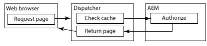
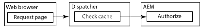

# Cachelagra skyddat innehåll {#caching-secured-content}

Behörighetskänslig cachelagring gör att du kan cachelagra skyddade sidor. Dispatcher kontrollerar användarens åtkomstbehörighet för en sida innan den cachelagrade sidan levereras.

Dispatcher innehåller modulen AuthChecker som implementerar behörighetskänslig cachelagring. När modulen aktiveras anropar Dispatcher en AEM för att utföra användarautentisering och behörighet för det begärda innehållet. Serversvaret avgör om innehållet levereras till webbläsaren från cachen eller inte.

Eftersom autentiserings- och auktoriseringsmetoderna är specifika för den AEM distributionen måste du skapa serverpaketet.

>[!NOTE]
>
>Använd filtren `deny` för att framtvinga begränsningar för skydd av filtret. Använd behörighetskänslig cachelagring för sidor som är konfigurerade för att ge åtkomst till en delmängd av användare eller grupper.

I följande diagram visas ordningen för händelser som inträffar när en webbläsare begär en sida som använder behörighetskänslig cachelagring.

## Sidan cachelagras och användaren är behörig {#page-is-cached-and-user-is-authorized}



1. Dispatcher fastställer att det begärda innehållet är cache-lagrat och giltigt.
1. Dispatcher skickar ett begärandemeddelande till återgivningen. Avsnittet HEAD innehåller alla rubrikrader från webbläsarbegäran.
1. Renderingen anropar auth checker-servern för att utföra säkerhetskontrollen och svarar på Dispatcher. Svarsmeddelandet innehåller en HTTP-statuskod på 200 som anger att användaren är behörig.
1. Dispatcher skickar ett svarsmeddelande till webbläsaren som består av rubrikraderna från återgivningssvaret och det cachelagrade innehållet i brödtexten.

## Sidan är inte cachelagrad och användaren är behörig {#page-is-not-cached-and-user-is-authorized}


1. Dispatcher fastställer att innehållet inte cachas eller behöver uppdateras.
1. Dispatcher vidarebefordrar den ursprungliga begäran till återgivningen.
1. Renderingen anropar den AEM auktoriserarservern (den här servern är inte Dispatcher AuthChcker-servleten) för att utföra en säkerhetskontroll. När användaren är auktoriserad inkluderar återgivningen den återgivna sidan i svarsmeddelandets brödtext.
1. Dispatcher vidarebefordrar svaret till webbläsaren. Dispatcher lägger till brödtexten i återgivningens svarsmeddelande i cachen.

## Användaren är inte auktoriserad {#user-is-not-authorized}



1. Dispatcher kontrollerar cachen.
1. Dispatcher skickar ett begärandemeddelande till återgivningen som innehåller alla rubrikrader från webbläsarens begäran.
1. Renderingen anropar Auth Checker-servern för att utföra en säkerhetskontroll som misslyckas och återgivningen vidarebefordrar den ursprungliga begäran till Dispatcher.
1. Dispatcher vidarebefordrar den ursprungliga begäran till återgivningen.
1. Renderingen anropar den AEM auktoriserarservern (den här servern är inte Dispatcher AuthChcker-servleten) för att utföra en säkerhetskontroll. När användaren är auktoriserad inkluderar återgivningen den återgivna sidan i svarsmeddelandets brödtext.
1. Dispatcher vidarebefordrar svaret till webbläsaren. Dispatcher lägger till brödtexten i återgivningens svarsmeddelande i cachen.

## Tillämpa behörighetskänslig cachelagring {#implementing-permission-sensitive-caching}

Så här implementerar du behörighetskänslig cachelagring:

* Utveckla en server som utför autentisering och auktorisering
* Konfigurera Dispatcher

>[!NOTE]
>
>Vanligtvis lagras säkra resurser i en separat mapp än osäkra filer. Till exempel /content/secure/

>[!NOTE]
>
>När det finns ett CDN (eller något annat cache-minne) framför Dispatcher bör du ställa in cache-rubrikerna så att CDN inte cachelagrar det privata innehållet. Till exempel: `Header always set Cache-Control private`.
>För AEM as a Cloud Service finns mer information om hur du anger privata cachelagringshuvuden på sidan [Caching](https://experienceleague.adobe.com/sv/docs/experience-manager-cloud-service/content/implementing/content-delivery/caching).

## Skapa Auth Checker-servleten {#create-the-auth-checker-servlet}

Skapa och distribuera en serverdator som autentiserar och auktoriserar den användare som begär webbinnehållet. Servern kan använda vilken autentisering som helst. Den kan också använda vilken auktoriseringsmetod som helst. Den kan till exempel använda AEM användarkonto och databas-ACL:er. Den kan också använda en LDAP-sökningstjänst. Du distribuerar servleten till den AEM instansen som Dispatcher använder som rendering.

Servern måste vara tillgänglig för alla användare. Därför bör din servlet utöka klassen `org.apache.sling.api.servlets.SlingSafeMethodsServlet` som ger skrivskyddad åtkomst till systemet.

Servern tar endast emot HEAD-begäranden från återgivningen, så du behöver bara implementera metoden `doHead`.

Renderingen innehåller URI:n för den begärda resursen som en parameter i HTTP-begäran. En auktoriseringsserver är till exempel tillgänglig via `/bin/permissioncheck`. Om du vill utföra en säkerhetskontroll på /content/geometrixx-outdoors/en.html innehåller återgivningen följande URL i HTTP-begäran:

`/bin/permissioncheck?uri=/content/geometrixx-outdoors/en.html`

Serletens svarsmeddelande måste innehålla följande HTTP-statuskoder:

* 200: Autentisering och auktorisering lyckades.

Följande exempelserver hämtar URL:en för den begärda resursen från HTTP-begäran. Koden använder Felix SCR `Property`-anteckningen för att ange värdet för egenskapen `sling.servlet.paths` till /bin/permissionsCheck. I metoden `doHead` hämtar servern sessionsobjektet och använder metoden `checkPermission` för att fastställa lämplig svarskod.

>[!NOTE]
>
>Värdet för egenskapen sling.servlet.paths måste aktiveras i tjänsten Sling Servlet Resolver (org.apache.sling.servlets.resolver.SlingServletResolver).

### Exempel på server {#example-servlet}

```java
package com.adobe.example;

import org.apache.felix.scr.annotations.Component;
import org.apache.felix.scr.annotations.Service;
import org.apache.felix.scr.annotations.Property;

import org.apache.sling.api.SlingHttpServletRequest;
import org.apache.sling.api.SlingHttpServletResponse;
import org.apache.sling.api.servlets.SlingSafeMethodsServlet;

import org.slf4j.Logger;
import org.slf4j.LoggerFactory;

import javax.jcr.Session;

@Component(metatype=false)
@Service
public class AuthcheckerServlet extends SlingSafeMethodsServlet {
 
    @Property(value="/bin/permissioncheck")
    static final String SERVLET_PATH="sling.servlet.paths";
    
    private Logger logger = LoggerFactory.getLogger(this.getClass());
    
    public void doHead(SlingHttpServletRequest request, SlingHttpServletResponse response) {
     try{ 
      //retrieve the requested URL
      String uri = request.getParameter("uri");
      //obtain the session from the request
      Session session = request.getResourceResolver().adaptTo(javax.jcr.Session.class);     
      //perform the permissions check
      try {
       session.checkPermission(uri, Session.ACTION_READ);
       logger.info("authchecker says OK");
       response.setStatus(SlingHttpServletResponse.SC_OK);
      } catch(Exception e) {
       logger.info("authchecker says READ access DENIED!");
       response.setStatus(SlingHttpServletResponse.SC_FORBIDDEN);
      }
     }catch(Exception e){
      logger.error("authchecker servlet exception: " + e.getMessage());
     }
    }
}
```

## Konfigurera Dispatcher för behörighetskänslig cachelagring {#configure-dispatcher-for-permission-sensitive-caching}

>[!NOTE]
>
>Om dina krav tillåter cachelagring av autentiserade dokument anger du egenskapen /allowAuthorized under avsnittet /cache till `/allowAuthorized 1`. Mer information finns i avsnittet [Cachelagring när autentisering används](/help/using/dispatcher-configuration.md).

Avsnittet auth_checker i dispatchern.any-filen styr beteendet för behörighetskänslig cachelagring. Avsnittet auth_checker innehåller följande underavsnitt:

* `url`: Värdet för egenskapen `sling.servlet.paths` för serverutrymmet som utför säkerhetskontrollen.

* `filter`: Filter som anger de mappar som behörighetskänslig cachelagring används på. Vanligtvis tillämpas ett `deny`-filter på alla mappar och `allow`-filter tillämpas på skyddade mappar.

* `headers`: Anger de HTTP-huvuden som auktoriseringsservern inkluderar i svaret.

När Dispatcher startas innehåller Dispatcher loggfil följande felsökningsnivåmeddelande:

`AuthChecker: initialized with URL 'configured_url'.`

I följande exempel konfigureras Dispatcher till att använda servleten för föregående ämne. I filteravsnittet utförs behörighetskontroller endast på säkra HTML-resurser.

### Exempelkonfiguration {#example-configuration}

```xml
/auth_checker
  {
  # request is sent to this URL with '?uri=<page>' appended
  /url "/bin/permissioncheck"
      
  # only the requested pages matching the filter section below are checked,
  # all other pages get delivered unchecked
  /filter
    {
    /0000
      {
      /glob "*"
      /type "deny"
      }
    /0001
      {
      /glob "/content/secure/*.html"
      /type "allow"
      }
    }
  # any header line returned from the auth_checker's HEAD request matching
  # the section below will be returned as well
  /headers
    {
    /0000
      {
      /glob "*"
      /type "deny"
      }
    /0001
      {
      /glob "Set-Cookie:*"
      /type "allow"
      }
    }
  }
```
